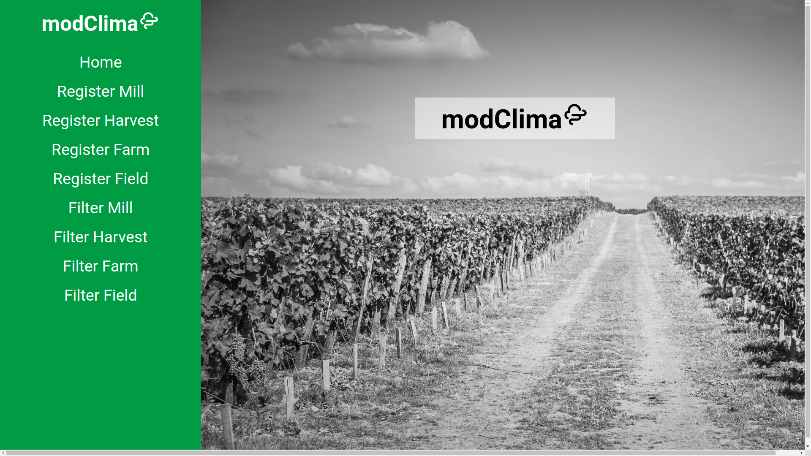

# modClima 🌦

A Fullstack Challenge developed for Cyan AgroAnalytics. The objective of this challenge is to create a web project to register units of a sugarcane mill on a database. Doing this challeng I have the opportunity to learn a little bit more about web development and digital agriculture.

## 🚀 Used Technologies

The project was developed with the following technologies:

- [JavaScript](https://www.javascript.com/)
- [Node.js](https://nodejs.org/en/)
- [ReactJS](https://reactjs.org/)
- [Cypress](https://www.cypress.io/)
- [Sqlite](https://www.sqlite.org/index.html)

## :heavy_check_mark: Result

 <p align="center">
  
</p>

[Live demo](https://modclima.herokuapp.com/)

## ✨ How to use

- ### **Pre-requirements**

    - It is **necessary** have the Node.js installed
    - Also is **necessary** have a package manager, **[NPM](https://www.npmjs.com/)** ou **[Yarn](https://yarnpkg.com/)**.

1. Make a clone:

```sh
  $ git clone https://github.com/thalytabdn/modClima
```

2. Running the application:

```sh
  # Install the dependencies
  $ npm install

  ## Create the database
  $ cd server
  $ npm run knex:migrate

  # Start the API
  $ npm start

  # Start the web application
  $ cd web
  $ npm start

 ```
  ---
  
<h4 align="center">
    Build with by <a href="https://www.linkedin.com/in/thalytabdn/" target="_blank">Thalyta Barbosa</a>
</h4>
